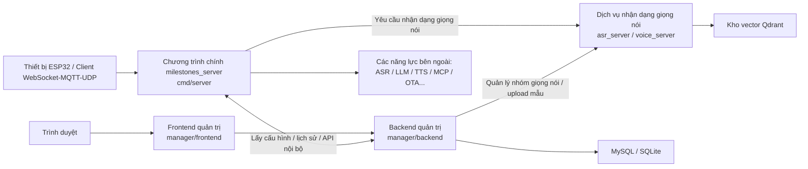

# Hướng dẫn biên dịch và triển khai

Tài liệu này dành cho các nhà phát triển cần biên dịch từ mã nguồn, debug và triển khai dự án này, tổng hợp cách biên dịch và triển khai cho: chương trình chính, frontend/backend của trang quản trị, và dịch vụ nhận dạng giọng nói (声纹服务).

Khuyến nghị đọc tài liệu theo thứ tự sau:

- Xem kiến trúc tổng thể trước, để nắm rõ vị trí và mối quan hệ gọi nhau giữa các dịch vụ
- Sau đó lần lượt hoàn thành biên dịch và triển khai theo thứ tự "Chương trình chính -> Backend quản trị -> Frontend quản trị -> Dịch vụ nhận dạng giọng nói"
- Cuối cùng, nếu cần đóng gói bản phát hành tích hợp (AIO), xem quy trình đóng gói AIO ở cuối bài

Tài liệu này ưu tiên giới thiệu cách biên dịch và triển khai riêng lẻ từng dịch vụ; hình thức AIO sẽ được nói riêng ở phần sau.

## 1. Giải thích về việc tách dịch vụ

Trong quá trình phát triển hàng ngày, liên kết thử nghiệm (integration test), hoặc khi cần thay thế riêng một dịch vụ nào đó, khuyến nghị dùng hình thức triển khai tách rời:

- Chương trình chính: `cmd/server`
- Backend quản trị: `manager/backend`
- Frontend quản trị: `manager/frontend`
- Dịch vụ nhận dạng giọng nói: submodule `asr_server`

Bốn thành phần này được biên dịch và khởi động riêng biệt, phù hợp nhất cho việc phát triển và debug.

Hình thức đóng gói tích hợp AIO được trình bày ở nửa sau tài liệu, phù hợp để làm gói phát hành hoặc gói bàn giao.

## 2. Kiến trúc tổng thể



### 2.1 Vị trí của từng dịch vụ trong kiến trúc

| Dịch vụ                     | Thư mục mã nguồn   | Nhiệm vụ chính                                                                              | Cổng thường dùng                |
| --------------------------- | ------------------ | ------------------------------------------------------------------------------------------- | ------------------------------- |
| Chương trình chính          | `cmd/server`       | Kết nối thiết bị, điều phối phiên (session), điều phối ASR/LLM/TTS, OTA, WebSocket/MQTT/UDP | `8989` / `2883` / `8990`        |
| Backend quản trị            | `manager/backend`  | API quản trị, quản lý cấu hình, lịch sử, quản lý nhóm giọng nói                             | `8080`                          |
| Frontend quản trị           | `manager/frontend` | Trang quản trị, wizard cấu hình, công cụ kiểm thử                                           | Môi trường dev: `3000`          |
| Dịch vụ nhận dạng giọng nói | `asr_server`       | Đăng ký, nhận dạng, xác thực giọng nói, API dạng stream                                     | Mặc định trong mã nguồn: `9000` |

### 2.2 Các mối quan hệ địa chỉ then chốt cần khớp nhau

Khi triển khai tách rời, 4 địa chỉ dưới đây bắt buộc phải khớp nhau:

| Chiều gọi                                         | Mục cấu hình                                                                                             | Giá trị điển hình       |
| ------------------------------------------------- | -------------------------------------------------------------------------------------------------------- | ----------------------- |
| Frontend -> Backend                               | `VITE_API_TARGET`                                                                                        | `http://127.0.0.1:8080` |
| Chương trình chính -> Backend quản trị            | `config/config.yaml` -> `manager.backend_url`                                                            | `http://127.0.0.1:8080` |
| Backend quản trị -> Dịch vụ nhận dạng giọng nói   | `manager/backend/config/config.json` -> `speaker_service.url` hoặc biến môi trường `SPEAKER_SERVICE_URL` | `http://127.0.0.1:9000` |
| Chương trình chính -> Dịch vụ nhận dạng giọng nói | `config/config.yaml` -> `voice_identify.base_url`                                                        | `http://127.0.0.1:9000` |

## 3. Chuẩn bị môi trường

### 3.1 Lấy mã nguồn và submodule

Dịch vụ nhận dạng giọng nói là một Git submodule, sau khi clone lần đầu hãy chạy:

```bash
git submodule update --init --recursive
```

Nếu bạn mới clone repo, khuyến nghị chạy trực tiếp:

```bash
git clone --recursive <repo-url>
```

### 3.2 Phiên bản công cụ được khuyến nghị

- Go: `1.24.x`, khớp với phiên bản `1.24.4` dùng trong CI
- Node.js: `20.x`
- npm: đi theo Node 20

### 3.3 Biên dịch local trên Linux — các thư viện dùng chung

Cả chương trình chính và dịch vụ nhận dạng giọng nói đều liên quan tới CGO, ONNX Runtime hoặc thư viện động ten-vad, trên Ubuntu có thể tham khảo:

```bash
sudo apt-get update
sudo apt-get install -y pkg-config libopus0 libopusfile-dev libc++1 libc++abi1
```

Việc biên dịch chương trình chính từ mã nguồn còn cần cài thêm ONNX Runtime 1.21.0, các bước có thể tham khảo trực tiếp mục "Biên dịch local" trong `README.md` ở thư mục gốc.

### 3.4 Hạ tầng nên chuẩn bị trước

- MySQL: cần thiết khi backend quản trị dùng MySQL
- Qdrant: cần thiết khi dịch vụ nhận dạng giọng nói dùng kiểu lưu trữ `qdrant`

Nếu chỉ để kiểm thử tính năng ở local:

- Backend quản trị có thể dùng tạm SQLite
- Dịch vụ nhận dạng giọng nói có thể dùng tạm kiểu lưu trữ JSON

## 4. Triển khai tách rời: biên dịch và triển khai từng dịch vụ

### 4.1 Chương trình chính

Thư mục mã nguồn: `cmd/server`

### Cấu hình quan trọng

Vị trí file cấu hình mặc định:

```text
config/config.yaml
```

Khi triển khai từ mã nguồn, những mục hay cần sửa nhất là:

- `manager.backend_url`
- `websocket.host` / `websocket.port`
- `mqtt_server.listen_port`
- `udp.listen_port`
- `voice_identify.enable`
- `voice_identify.base_url`

Nếu dùng hình thức triển khai tách rời, khuyến nghị sửa đúng hai mục sau trước:

```yaml
manager:
  backend_url: 'http://127.0.0.1:8080'

voice_identify:
  enable: true
  base_url: 'http://127.0.0.1:9000'
```

### Biên dịch

```bash
go mod tidy
go build -o milestones_server ./cmd/server
```

Khi biên dịch local trên Windows PowerShell và cần bật Silero VAD, cần cho CGO tìm được header ONNX Runtime và import library trước:

```powershell
$env:CGO_ENABLED = "1"
$env:PATH = "C:\msys64\mingw64\bin;$env:PATH"
$env:C_INCLUDE_PATH = "E:\onnxruntime-win-x64-1.21.0\include"
$env:LIBRARY_PATH = "E:\onnxruntime-win-x64-1.21.0\lib"
go mod tidy
go build -o milestones_server.exe ./cmd/server
```

### Khởi động

```bash
./milestones_server -c config/config.yaml
```

### Khuyến nghị khi triển khai

1. Ở chế độ triển khai tách rời, bản thân chương trình chính không chịu trách nhiệm quản lý tiến trình của frontend/backend quản trị và dịch vụ nhận dạng giọng nói.
2. Trước khi khởi động chương trình chính, khuyến nghị backend quản trị đã có thể truy cập được, nếu không thì bên cung cấp cấu hình `manager` sẽ lấy cấu hình thất bại.
3. Nếu thiết bị kết nối qua WebSocket, địa chỉ kết nối trung tâm thường là `ws://<host>:8989/milestones/v1/`.

### 4.2 Backend quản trị

Thư mục mã nguồn: `manager/backend`

### Cấu hình quan trọng

Vị trí file cấu hình mặc định:

```text
manager/backend/config/config.json
```

Các mục cần chú ý:

- `database.type`: `mysql` hoặc `sqlite`
- `database.mysql` / `database.sqlite`
- `speaker_service.url`
- `history.audio_base_path`

Các biến môi trường được hỗ trợ để ghi đè:

- `DB_HOST`
- `DB_PORT`
- `DB_USER`
- `DB_PASSWORD`
- `DB_NAME`
- `SPEAKER_SERVICE_URL`
- `AUDIO_BASE_PATH`

### Biên dịch

```bash
cd manager/backend
go mod tidy
go build -o main .
```

### Khởi động

```bash
cd manager/backend
./main -c config/config.json
```

Trong môi trường dev cũng có thể chạy trực tiếp:

```bash
cd manager/backend
go run main.go -c config/config.json
```

### Khuyến nghị khi triển khai

1. Debug local nên ưu tiên dùng SQLite để giảm phụ thuộc.
2. Khi liên kết thử nghiệm tính năng nhận dạng giọng nói, hãy đảm bảo `speaker_service.url` đã trỏ đúng tới dịch vụ nhận dạng giọng nói.
3. Sau khi backend quản trị khởi động, cả chương trình chính và frontend đều nên trỏ tới dịch vụ này.

### 4.3 Frontend quản trị

Thư mục mã nguồn: `manager/frontend`

Frontend quản trị chủ yếu dùng cho phát triển và liên kết thử nghiệm ở local, chỉ cần cài dependency rồi khởi động dev server:

```bash
cd manager/frontend
npm ci
npm run dev
```

Địa chỉ dev mặc định:

- Trang frontend: `http://127.0.0.1:3000`
- Đích proxy API: `http://127.0.0.1:8080`

Nếu cần sửa đích proxy, có thể thiết lập:

```bash
VITE_API_TARGET=http://127.0.0.1:8080
```

Hoặc sửa file `manager/frontend/.env`.

### 4.4 Dịch vụ nhận dạng giọng nói

Thư mục mã nguồn: `asr_server`

### Lưu ý quan trọng

`asr_server` là một submodule, khi chạy độc lập từ mã nguồn thì mặc định đọc:

```text
asr_server/config.json
```

Cổng mặc định trong cấu hình submodule hiện tại là `9000`. Khi triển khai thực tế, nhất định phải giữ nhất quán với địa chỉ dịch vụ nhận dạng giọng nói được khai báo trong chương trình chính và backend quản trị.

### Cấu hình quan trọng

Các mục cần chú ý:

- `server.port`
- `speaker.enabled`
- `speaker.storage_type`
- `speaker.qdrant.host`
- `speaker.qdrant.port`
- `speaker.qdrant.collection_name`
- `speaker.model_path`

Lựa chọn thường gặp:

1. Liên kết thử nghiệm khi phát triển: `speaker.storage_type = "json"`
2. Triển khai production: `speaker.storage_type = "qdrant"`

### Biên dịch từ mã nguồn

Linux / macOS:

```bash
cd asr_server
go mod tidy
CGO_ENABLED=1 go build -o voice_server main.go
```

Windows PowerShell:

```powershell
cd asr_server
$env:CGO_ENABLED=1
go mod tidy
go build -o voice_server.exe main.go
```

### Khởi động

Linux / macOS:

```bash
cd asr_server
export LD_LIBRARY_PATH="$PWD/lib:$PWD/lib/ten-vad/lib/Linux/x64:${LD_LIBRARY_PATH:-}"
./voice_server
```

Windows:

```powershell
cd asr_server
.\voice_server.exe
```

### Khuyến nghị khi triển khai

1. Khi phát triển local, nên dùng kiểu lưu trữ JSON để chạy thông API trước, sau đó mới chuyển sang Qdrant.
2. Nếu chương trình chính đã bật `voice_identify.enable=true`, hãy đồng bộ sửa `voice_identify.base_url` trong chương trình chính.
3. `speaker_service.url` của backend quản trị cũng bắt buộc phải trỏ tới cùng một địa chỉ dịch vụ nhận dạng giọng nói.

### 4.5 Thứ tự khởi động được khuyến nghị

Tài liệu này giới thiệu theo thứ tự "Chương trình chính -> Backend quản trị -> Frontend quản trị -> Dịch vụ nhận dạng giọng nói", nhưng khi khởi động thực tế nên thực hiện theo thứ tự phụ thuộc:

1. MySQL / SQLite
2. Qdrant
3. Dịch vụ nhận dạng giọng nói `asr_server`
4. Backend quản trị `manager/backend`
5. Chương trình chính `cmd/server`
6. Frontend quản trị `manager/frontend`

## 5. Quy trình đóng gói AIO nhất quán với bản Release

Nếu mục tiêu của bạn là tái tạo lại gói phát hành hiện có của repo, thay vì triển khai tách rời, khuyến nghị thực hiện theo tư duy của CI.

Trước khi bắt đầu đóng gói AIO, hãy đảm bảo bạn đã hiểu và chạy thông quy trình triển khai tách rời ở Chương 4.

Hình thức AIO của repo hiện tại sẽ build frontend trước, sau đó dùng Go build tags để đóng gói các năng lực dưới đây vào cùng chương trình chính:

- `manager`
- `asr_server`
- `embed_ui`

Do đó, `milestones_server` trong sản phẩm cuối cùng thực chất là "chương trình chính + backend quản trị + dịch vụ nhận dạng giọng nói + frontend quản trị đã được nhúng vào".

### 5.1 Build frontend trước

```bash
cd manager/frontend
npm ci
npm run build
```

Sau đó copy sản phẩm build của frontend vào thư mục static của backend:

```bash
mkdir -p ../backend/static/dist
cp -r dist/* ../backend/static/dist/
```

### 5.2 Biên dịch chương trình chính có nhúng các dịch vụ

Quay lại thư mục gốc của repo và chạy:

```bash
go mod tidy
go build -tags "nolibopusfile asr_server manager embed_ui" -ldflags "-s -w" -o milestones_server ./cmd/server
```

### 5.3 Khởi động gói AIO

Khi đóng gói, CI sẽ đưa các file dưới đây vào cùng thư mục phát hành:

- `main_config.yaml`
- `manager.json`
- `asr_server.json`
- `models/`
- `data/`

Khi chạy thủ công ở local, có thể tham khảo:

```bash
./milestones_server \
  -c main_config.yaml \
  -manager-config manager.json \
  -asr-config asr_server.json
```

### 5.4 Bổ sung thêm về đóng gói AIO

Khi phát hành thực tế, thường sẽ cần hoàn thành thêm:

- Đóng gói các thư viện chạy (runtime library) của ten-vad / sherpa-onnx
- Copy các thư mục `models/`, `data/`, và các file cấu hình mẫu
- Đổi tên thư mục theo nền tảng và nén lại

## 6. Hướng dẫn sử dụng cơ bản sau khi hoàn tất triển khai

### 6.1 Mở trang quản trị

Sau khi triển khai xong, truy cập trình duyệt vào:

```text
http://<IP máy chủ hoặc tên miền>:8080
```

Nếu bạn triển khai tách rời frontend/backend và chưa làm reverse proxy thống nhất, hãy truy cập theo đúng cổng phát hành frontend của bạn.

### 6.2 Hoàn thành cấu hình cơ bản

Khi vào lần đầu, khuyến nghị làm theo wizard cấu hình trên trang quản trị để hoàn thành:

1. Địa chỉ OTA
2. Cấu hình VAD
3. Cấu hình ASR
4. Cấu hình LLM
5. Cấu hình TTS

### 6.3 Kiểm tra dịch vụ nhận dạng giọng nói

Nếu cần dùng tính năng nhận dạng giọng nói:

1. Tạo nhóm giọng nói trên trang quản trị
2. Upload mẫu âm thanh
3. Xác nhận backend quản trị có thể truy cập được dịch vụ nhận dạng giọng nói
4. Xác nhận chương trình chính đã bật `voice_identify.enable=true`
5. Xác nhận `voice_identify.base_url` của chương trình chính trỏ đúng địa chỉ

### 6.4 Kết nối thiết bị

Thông tin kết nối thường gặp của thiết bị:

- WebSocket: `ws://<host>:8989/milestones/v1/`
- API OTA: `http://<host>:8989/milestones/ota/`
- MQTT: `<host>:2883`
- UDP: `<host>:8990`

### 6.5 Vòng kiểm thử liên kết tối thiểu

Khuyến nghị thực hiện kiểm thử "smoke test" theo thứ tự sau:

1. Mở trang quản trị, xác nhận trang tải được.
2. Trên trang quản trị, hoàn thành một bộ cấu hình VAD / ASR / LLM / TTS dùng được.
3. Xác nhận log của chương trình chính đã lấy cấu hình từ trang quản trị thành công.
4. Nếu bật tính năng nhận dạng giọng nói, hãy upload mẫu trên trang quản trị trước, sau đó test nhận dạng.
5. Để thiết bị lấy địa chỉ WebSocket hoặc MQTT/UDP qua OTA rồi kết nối vào chương trình chính.

## 7. Các lỗi thường gặp

### 7.1 Địa chỉ dịch vụ nhận dạng giọng nói không nhất quán

Vấn đề thường gặp nhất là hai địa chỉ dưới đây không được sửa đồng thời:

- `manager/backend/config/config.json` -> `speaker_service.url`
- `config/config.yaml` -> `voice_identify.base_url`

### 7.2 Quên khởi tạo submodule

Nếu file `asr_server/server/setup.go` không tồn tại, nghĩa là submodule chưa được kéo về, cả việc biên dịch AIO lẫn biên dịch Release đều sẽ thất bại.

### 7.3 Nhầm lẫn giữa "triển khai tách rời" và "gói AIO"

Hãy ghi nhớ:

- Triển khai tách rời: 4 dịch vụ được build và chạy riêng biệt
- Đóng gói AIO: frontend, backend, dịch vụ nhận dạng giọng nói đều được biên dịch chung vào `milestones_server`

Hãy xác định rõ hình thức mục tiêu trước, sau đó mới quyết định lệnh build và file cấu hình cần dùng.
