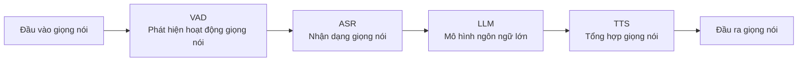

# Hướng dẫn triển khai và sử dụng backend AI Tiểu Trí (小智AI) trên ESP32

Hướng dẫn này cung cấp quy trình triển khai đầy đủ khi sử dụng dự án này làm backend trên ESP32, bao gồm ba phần chính: triển khai server, cấu hình thiết bị và cấu hình control panel.

## 1. Triển khai Server

Có hai cách triển khai server, một là triển khai trên máy vật lý (bare metal), hai là triển khai bằng Docker.

### Triển khai Docker

Bạn có thể triển khai Docker theo hai cách sau:

- **Cách 1 (khuyến nghị - có kèm control panel)**: [Bắt đầu nhanh với Docker Compose »](doc/docker_compose.md)
- **Cách 2 (chỉ thuần dịch vụ, không có control panel)**: [Bắt đầu nhanh với Docker »](doc/docker.md)

**Lưu ý quan trọng:**

- Lệnh `docker-compose` là một công cụ độc lập với Docker Engine. Nếu bạn đang dùng phiên bản Docker mới hơn, cũng có thể dùng trực tiếp lệnh `docker compose` (một subcommand của CLI `docker`), cả hai có chức năng tương đương.

**Giải thích ánh xạ cổng dịch vụ:**
Sau khi triển khai, các cổng dịch vụ bên trong container sẽ được ánh xạ ra máy host, cấu hình mặc định như sau:

- **`8989:8989`**: Cổng dịch vụ WebSocket.
- **`2883:2883`**: Cổng dịch vụ MQTT.
- **`8888:8888/udp`**: Cổng dịch vụ UDP.

### Triển khai trên máy vật lý

Tham khảo README.md

## 2. Cấu hình địa chỉ OTA update cho ESP32

Thiết bị ESP32 hỗ trợ hai cách để cấu hình địa chỉ của server OTA:

### Cách 1: Sửa qua cấu hình WiFi (áp dụng khi thiết bị đã được triển khai)

Cách này cần thực hiện thông qua giao diện cấu hình mạng (Web) của thiết bị.

**Các bước thực hiện:**

1.  Khởi động thiết bị ESP32, để nó vào chế độ cấu hình mạng WiFi (biểu hiện là bật một AP hotspot).
2.  Dùng điện thoại hoặc máy tính kết nối vào hotspot này, và truy cập trang cấu hình của nó bằng trình duyệt (địa chỉ thường là `192.168.4.1`).
3.  Trong trang này, tìm mục tùy chọn liên quan đến **OTA**.
4.  Sửa địa chỉ server OTA thành: `http://<IP server của bạn>:8989/milestones/ota/`
    **Ví dụ**: `http://192.168.1.12:8989/milestones/ota/`
5.  Lưu cấu hình và cấu hình mạng.

### Cách 2: Sửa qua cấu hình khi biên dịch

Cách này cần biên dịch lại firmware của ESP32, sửa file cấu hình dự án để đặt sẵn địa chỉ OTA.

**Các bước thực hiện:**

1.  Trong thư mục dự án ESP32 của bạn, tìm đến vị trí tương ứng trong file cấu hình `config.json`.
2.  Thêm hoặc sửa mục cấu hình địa chỉ server OTA:
    ```json
    "CONFIG_OTA_URL": "http://<IP server của bạn>/milestones/ota/"
    ```

## 3. Cấu hình Control Panel

### Cấu hình dịch vụ

```mermaid
graph TD
    subgraph Server[Máy chủ]
        OTA[Dịch vụ OTA]
        MQTT_Broker[MQTT Server]
        UDP_Service[Dịch vụ UDP]
    end

    subgraph Config[Liên kết cấu hình]
        Key[Khóa ký (signing key)] --> OTA
        Key --> MQTT_Broker

        MQTT_Broker -->|Tài khoản mật khẩu quản trị viên| Console_MQTT[MQTT Client của Control Panel]
        MQTT_Broker -->|IP:2883| OTA
    end

    UDP_Service -->|Host bên ngoài: IP server| App[Ứng dụng bên ngoài]

```

#### Cấu hình OTA

Sửa khóa ký (signing key) sao cho khớp với "khóa ký" trong trang cấu hình mqtt server.
Có thể chọn có bật cấu hình MQTT hay không, nếu bật, đặt endpoint MQTT là IP server:2883

#### Cấu hình MQTT

Nếu dùng MQTT broker tích hợp sẵn, sửa địa chỉ Broker thành 127.0.0.1, cổng sửa thành 2883.
Nếu dùng MQTT bên ngoài, xin sửa theo nhu cầu thực tế.
Sửa cấu hình xác thực thành tài khoản và mật khẩu quản trị viên trong cấu hình MQTT Server.

#### Cấu hình MQTT Server

Đặt cổng lắng nghe là 2883
Thiết lập tài khoản và mật khẩu quản trị viên
Đặt khóa ký giống với khóa ký ở trang cấu hình ota

#### Cấu hình UDP

Đặt cổng lắng nghe là 8888
Đặt host bên ngoài là IP server của bạn, ví dụ 192.168.1.12

#### Cấu hình MCP

MCP server toàn cục là MCP server bên ngoài, nếu chưa có MCP server bên ngoài thì có thể tạm thời chưa cần cấu hình.

### Cấu hình AI



#### Cấu hình VAD

Dùng WebRTC VAD, không cần cấu hình bên ngoài.

#### Cấu hình ASR

Điền cấu hình cho ASR; ngay cả khi server được triển khai bằng docker, và không có ASR triển khai cục bộ, bạn vẫn có thể tự triển khai thủ công.
Tham khảo hướng dẫn triển khai tại [Hướng dẫn phát triển dịch vụ nhận dạng giọng nói thời gian thực FunASR](https://github.com/modelscope/FunASR/blob/main/runtime/docs/SDK_advanced_guide_online_zh.md)

#### Cấu hình LLM

Điền API Key của riêng bạn

#### Cấu hình TTS

Lưu ý: TTS của Tiểu Trí (小智) hiện đã không thể sử dụng bình thường, khuyến nghị dùng edge (EdgeTTS)
