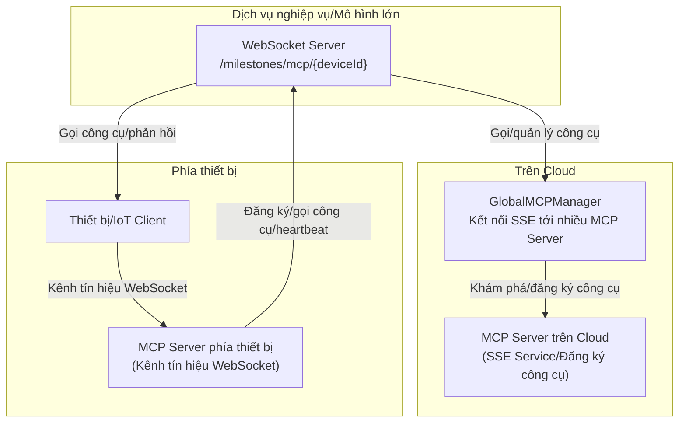

# Tài liệu Chức năng & Logic MCP

## 1. Tổng quan

MCP (Model Context Protocol) là giao thức quản lý và gọi công cụ (tool) đa năng được triển khai dựa trên [Eino framework](https://github.com/cloudwego/eino), hỗ trợ đăng ký, khám phá và gọi công cụ ở cả cấp độ toàn cục (global) và cấp độ thiết bị (device). Giao thức này được ứng dụng rộng rãi trong các kịch bản đối thoại AI, IoT (Internet of Things)...

## 2. Đặc điểm chức năng

### 🌐 Quản lý công cụ MCP toàn cục

- Hỗ trợ kết nối nhiều MCP Server thông qua SSE, tự động khám phá và đăng ký công cụ
- Proxy gọi công cụ, giao diện thống nhất
- Giám sát trạng thái kết nối và tự động kết nối lại

### 📱 Quản lý MCP theo thiết bị

- Mỗi thiết bị có kết nối MCP độc lập, hỗ trợ giao thức WebSocket
- Đăng ký và quản lý công cụ riêng cho từng thiết bị
- Giới hạn số lượng kết nối và tự động dọn dẹp

### 🔧 Tích hợp Eino Framework

- Triển khai interface `tool.InvokableTool`, hỗ trợ gọi công cụ gốc (native) của Eino
- An toàn kiểu dữ liệu (type-safe), xử lý theo luồng (streaming)

## 3. Thiết kế kiến trúc



## 4. Hướng dẫn cấu hình

### Ví dụ config.yaml

```yaml
mcp:
  global:
    enabled: true
    servers:
      - name: 'filesystem'
        sse_url: 'http://localhost:3001/sse'
        enabled: true
    reconnect_interval: 5
    max_reconnect_attempts: 10
  device:
    enabled: true
    websocket_path: '/milestones/mcp/'
    max_connections_per_device: 5
```

### Giải thích tham số

| Tham số                               | Kiểu   | Giải thích                                 |
| ------------------------------------- | ------ | ------------------------------------------ |
| mcp.global.enabled                    | bool   | Có bật MCP Manager toàn cục hay không      |
| mcp.global.servers                    | array  | Danh sách MCP Server                       |
| mcp.global.reconnect_interval         | int    | Khoảng thời gian kết nối lại (giây)        |
| mcp.global.max_reconnect_attempts     | int    | Số lần kết nối lại tối đa                  |
| mcp.device.enabled                    | bool   | Có bật MCP Manager theo thiết bị hay không |
| mcp.device.websocket_path             | string | Tiền tố đường dẫn WebSocket                |
| mcp.device.max_connections_per_device | int    | Số kết nối tối đa cho mỗi thiết bị         |

## 5. Giao diện API

### Endpoint WebSocket

- Kết nối MCP thiết bị:
  - `ws://<host>:<port>/milestones/mcp/{deviceId}`
  - Sau khi kết nối, server gửi thông điệp khởi tạo (initialize), client phản hồi danh sách công cụ, thiết lập giao tiếp hai chiều
- Ví dụ định dạng thông điệp:

```json
{
  "jsonrpc": "2.0",
  "method": "tools/list",
  "id": 1,
  "params": {}
}
```

### Giao diện REST

- Lấy danh sách công cụ của thiết bị:
  - `GET /milestones/api/mcp/tools/{deviceId}`
  - Ví dụ phản hồi:

```json
{
  "deviceId": "device123",
  "tools": {
    "filesystem_read_file": {
      "name": "read_file",
      "description": "Đọc nội dung file",
      "type": "global"
    },
    "device_sensor_data": {
      "name": "sensor_data",
      "description": "Lấy dữ liệu cảm biến",
      "type": "device"
    }
  },
  "globalCount": 5,
  "deviceCount": 3,
  "totalCount": 8,
  "timestamp": 1704067200
}
```

## 6. Ví dụ sử dụng điển hình

### Gọi từ phía Go

```go
// Lấy danh sách công cụ toàn cục
manager := mcp.GetGlobalMCPManager()
tools := manager.GetAllTools()
for name, tool := range tools {
    result, err := tool.InvokableRun(context.Background(), `{"path": "/tmp/test.txt"}`)
    if err != nil {
        log.Errorf("Gọi công cụ thất bại: %v", err)
        continue
    }
    log.Infof("Kết quả công cụ %s: %s", name, result)
}
```

### Kết nối WebSocket phía thiết bị (JS)

```javascript
const ws = new WebSocket('ws://localhost:8989/milestones/mcp/device123');
ws.onopen = function () {
  console.log('Kết nối MCP đã được thiết lập');
};
ws.onmessage = function (event) {
  const message = JSON.parse(event.data);
  if (message.method === 'initialize') {
    ws.send(
      JSON.stringify({
        jsonrpc: '2.0',
        id: message.id,
        result: {
          protocolVersion: '2024-11-05',
          serverInfo: { name: 'device-mcp-server', version: '1.0.0' },
        },
      }),
    );
  }
};
```

## 7. Các điểm kỹ thuật chính

- MCP Manager toàn cục kết nối với nhiều MCP Server thông qua SSE, tự động khám phá và đăng ký công cụ, hỗ trợ tự động kết nối lại khi mất kết nối và kiểm tra sức khỏe (health check).
- MCP Manager theo thiết bị duy trì kết nối độc lập cho mỗi thiết bị, hỗ trợ WebSocket và giao thức IoT, tự động dọn dẹp các thiết bị offline.
- Công cụ được triển khai thống nhất theo interface `InvokableTool`, hỗ trợ kiểm tra tham số, thử lại khi gọi (retry), định dạng kết quả trả về.
- Khi tích hợp với LLM, hệ thống tự động lấy toàn bộ công cụ MCP và truyền cho mô hình lớn, hỗ trợ phản hồi dạng streaming và vòng lặp khép kín gọi công cụ.
- Xử lý lỗi đầy đủ, hỗ trợ cơ chế fallback, ghi log truy vết (logging/tracing) và đảm bảo tính tương thích.

## 8. Xử lý sự cố và đề xuất tối ưu

- Kiểm tra trạng thái kết nối SSE/WebSocket, chú ý các lỗi kết nối, đăng ký, gọi công cụ trong log
- Khi gọi công cụ thất bại, kiểm tra định dạng tham số và tình trạng đăng ký công cụ
- Thiết lập hợp lý khoảng thời gian kết nối lại, số kết nối tối đa, định kỳ dọn dẹp các phiên (session) không hợp lệ
- Có thể mở rộng thêm các tính năng nâng cao như kiểm soát quyền, bật/tắt công cụ động, trả kết quả về...

## 9. Tài liệu tham khảo

- [Tài liệu Eino Framework](https://www.cloudwego.io/docs/eino/)
- [Đặc tả giao thức MCP](https://github.com/mark3labs/mcp-go)
- [Đặc tả SSE](https://developer.mozilla.org/en-US/docs/Web/API/Server-sent_events)
- [Giao thức WebSocket](https://tools.ietf.org/html/rfc6455)

## 10. MCP phía thiết bị (Kênh tín hiệu WebSocket)

MCP phía thiết bị thiết lập kết nối với server thông qua kênh tín hiệu WebSocket, thực hiện đăng ký công cụ, gọi công cụ và quản lý phiên (session) ở cấp độ thiết bị, phù hợp với các kịch bản thiết bị biên (edge device), IoT.

### Quy trình điển hình

1. Thiết bị thiết lập kết nối WebSocket qua `ws://<host>:<port>/milestones/mcp/{deviceId}`.
2. Sau khi server nhận được kết nối, sẽ tạo/lấy phiên MCP thiết bị tương ứng (DeviceMcpSession), và khởi tạo instance MCP client.
3. Server gửi thông điệp khởi tạo qua kênh tín hiệu, thiết bị phản hồi và có thể đồng bộ danh sách công cụ.
4. Hai bên có thể tương tác qua giao thức JSON-RPC để gọi công cụ, gửi thông báo, heartbeat...
5. Khi kết nối bị ngắt hoặc hết thời gian chờ, hệ thống tự động dọn dẹp phiên và tài nguyên.

### Giao diện chính và định dạng thông điệp

- Endpoint kết nối: `ws://<host>:<port>/milestones/mcp/{deviceId}`
- Thông điệp khởi tạo:

```json
{
  "jsonrpc": "2.0",
  "method": "initialize",
  "id": 1,
  "params": {
    /* ... */
  }
}
```

- Yêu cầu danh sách công cụ:

```json
{
  "jsonrpc": "2.0",
  "method": "tools/list",
  "id": 2,
  "params": {}
}
```

- Yêu cầu/phản hồi gọi công cụ, thông báo... đều tuân theo đặc tả JSON-RPC 2.0.

### Quản lý phiên và kết nối

- Mỗi ID thiết bị duy trì một DeviceMcpSession độc lập, hỗ trợ nhiều loại kết nối MCP (WebSocket, IoT...).
- Hỗ trợ giới hạn số kết nối tối đa, gửi heartbeat (ping) định kỳ, tự động phát hiện và dọn dẹp khi mất kết nối.
- Khi ngắt kết nối, tự động giải phóng tài nguyên, đảm bảo hệ thống ổn định.

### Heartbeat và xử lý mất kết nối

- Thiết bị và server định kỳ gửi thông điệp ping để kiểm tra tính sống của kết nối.
- Nếu quá 2 phút không có heartbeat, hệ thống coi là offline, tự động ngắt kết nối và dọn dẹp phiên.

### Sự phối hợp giữa thiết bị và cloud

- MCP phía thiết bị phù hợp cho việc đăng ký công cụ cục bộ, thu thập dữ liệu thời gian thực, suy luận AI ở biên (edge AI inference)...
- MCP phía Cloud chịu trách nhiệm đăng ký công cụ toàn cục, tổng hợp năng lực đa thiết bị, điều phối thống nhất.
- Hai bên có thể phối hợp để cung cấp khả năng gọi công cụ phong phú cho mô hình lớn/hệ thống nghiệp vụ.
