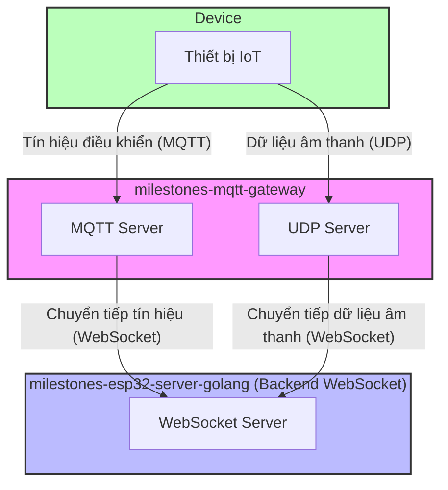

# Hướng dẫn cấu hình MQTT UDP Bridge

---

### Giải thích thuật ngữ

- **milestones-mqtt-gateway:** Dự án mqtt udp bridge chính thức của tác giả Xiage (虾哥), hiện thực việc chuyển đổi giao thức MQTT và UDP sang WebSocket. Dịch vụ này cho phép thiết bị truyền các thông điệp điều khiển qua giao thức MQTT, đồng thời truyền dữ liệu âm thanh hiệu quả qua giao thức UDP, và bridge (cầu nối) các dữ liệu này sang dịch vụ WebSocket. [milestones-mqtt-gateway](https://github.com/78/milestones-mqtt-gateway)
- **milestones-esp32-server-golang:** Chính là dự án này.

### Kiến trúc tổng thể



## I. Hướng dẫn cấu hình MQTT UDP Bridge

### Các bước cài đặt

---

1. Clone repository

```
git clone 'https://github.com/78/milestones-mqtt-gateway'
cd milestones-mqtt-gateway
```

2. Cài đặt dependency

```
npm install
```

3. Tạo file cấu hình

```
mkdir -p config
cp config/mqtt.json.example config/mqtt.json
```

4. Chỉnh sửa file cấu hình `config/mqtt.json`, thiết lập các tham số phù hợp

### Giải thích cấu hình

File cấu hình `config/mqtt.json` cần chứa nội dung sau:

- `chat_servers`: điền IP và cổng của server Milestones Golang, **_path bắt buộc phải là `/milestones/mqtt_udp/v1/`_**

```
{
  "debug": false,
  "development": {
    "mac_addresss": ["aa:bb:cc:dd:ee:ff"],
    "chat_servers": ["ws://192.168.0.100:8989/milestones/mqtt_udp/v1/"]
  },
  "production": {
    "chat_servers": ["ws://192.168.0.100:8989/milestones/mqtt_udp/v1/"]
  }
}
```

### Biến môi trường

Tạo file `.env` và thiết lập các biến môi trường sau:

```
MQTT_PORT=1883              # Cổng của MQTT server
UDP_PORT=8884               # Cổng của UDP server
PUBLIC_IP=192.168.0.100     # IP công khai (public) của server

#MQTT_SIGNATURE_KEY=mqtt_key # Khóa mqtt, tùy chọn; nếu cấu hình sẽ thực hiện xác thực mqtt, cần trùng với key cấu hình ở phía websocket server
```

### Chạy dịch vụ

##### Môi trường phát triển

```
# Chạy trực tiếp
node app.js

# Chạy ở chế độ debug
DEBUG=mqtt-server node app.js
```

---

## II. Hướng dẫn cấu hình dịch vụ backend Milestones Golang

### 1. Giải thích các mục cấu hình quan trọng

#### Tắt MQTT server và UDP server local

```yaml
mqtt:
  enable: false
  broker: '127.0.0.1'
  type: 'tcp'
  port: 2883
  client_id: 'milestones_server'
  username: 'admin'
  password: 'test!@#'
```

#### Cấu hình OTA (thiết bị lấy tham số kết nối thông qua OTA)

- `ota.signature_key`: cần phải trùng với biến **_MQTT_SIGNATURE_KEY_** trong file `.env` của milestones-mqtt-bridge
- `test`/`external`: phân biệt môi trường nội bộ/bên ngoài
- `websocket.url`: địa chỉ dịch vụ WebSocket được trả về
- `mqtt.endpoint`: địa chỉ và cổng của dịch vụ MQTT
- `mqtt.enable`: có bật MQTT hay không (khi `true`, thiết bị sẽ ưu tiên dùng MQTT+UDP)

```yaml
ota:
  signature_key: 'mqtt_key'
  test:
    websocket:
      url: 'ws://192.168.1.97:8989/milestones/v1/'
    mqtt:
      enable: true
      endpoint: '192.168.1.97:5883'
  external:
    websocket:
      url: 'wss://www.tb263.cn:55555/go_ws/milestones/v1/'
    mqtt:
      enable: true
      endpoint: 'mqtt.youdomain.cn'
```

---

## III. Tài liệu tham khảo

- [mqtt_udp.md](./mqtt_udp.md) (kiến trúc chi tiết, cấu hình, luồng xử lý)
- [mqtt_udp_protocol.md](./mqtt_udp_protocol.md) (giao thức và luồng dữ liệu)
- [config.md](./config.md) (giải thích chi tiết các mục cấu hình)
