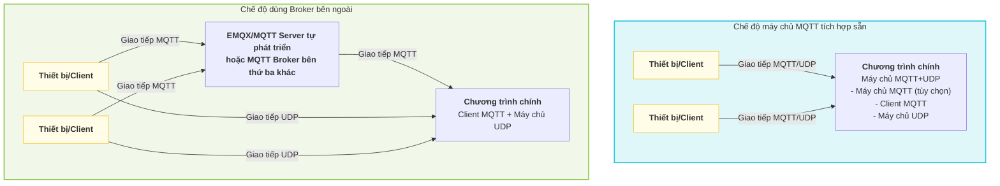

# Quy trình cấu hình MQTT UDP server

Dự án này hiện thực **máy chủ MQTT+UDP tự phát triển riêng**, dùng để xử lý hiệu quả việc truyền dữ liệu âm thanh và các dữ liệu khác giữa thiết bị và server. Kiến trúc linh hoạt, hỗ trợ nhiều cách triển khai và thay thế, phù hợp với nhiều tình huống nghiệp vụ khác nhau.

## 1. Đặc điểm kiến trúc và tính linh hoạt

- **Máy chủ MQTT+UDP tự phát triển**: dự án tích hợp sẵn một máy chủ giao thức MQTT hoàn chỉnh và kênh âm thanh UDP, hỗ trợ thiết bị thiết lập phiên (session) thông qua MQTT, các dữ liệu về sau đi qua UDP, vừa đảm bảo độ tin cậy vừa đảm bảo tính thời gian thực.
- **Cách triển khai máy chủ MQTT có thể tùy chọn**:
  - Có thể chạy như một phần của chương trình chính (server), khởi động cùng tiến trình chính, phù hợp với triển khai tích hợp (all-in-one).
  - Cũng có thể triển khai độc lập thành một tiến trình riêng, thuận tiện cho việc mở rộng theo chiều ngang và cô lập tài nguyên.
- **Hỗ trợ máy chủ MQTT của bên thứ ba**:
  - Kiến trúc dự án hỗ trợ thay thế máy chủ MQTT tích hợp sẵn bằng các MQTT Broker của bên thứ ba như EMQX, hoặc MQTT Server tự phát triển khác.
  - Chỉ cần điều chỉnh các tham số liên quan tới `mqtt` trong file cấu hình, chương trình chính có thể hoạt động như một client thuần túy để kết nối tới Broker bên ngoài, phù hợp cho các kịch bản cluster quy mô lớn và yêu cầu tính sẵn sàng cao.
- **Hỗ trợ tích hợp với dự án milestones-mqtt-gateway chính thức của Xiage**
  - Đã tương thích với dự án mã nguồn mở milestones-mqtt-gateway của Xiage, có thể tích hợp sử dụng
  - [Xem chi tiết tại mqtt_bridge.md](./mqtt_bridge.md)

### Sơ đồ kiến trúc triển khai

Sơ đồ dưới đây thể hiện hai cách triển khai điển hình, giúp bạn hiểu rõ hơn về kiến trúc linh hoạt của dự án:



**Giải thích:**

- <b>Chế độ máy chủ MQTT tích hợp sẵn</b>: chương trình chính tích hợp cả máy chủ MQTT và máy chủ UDP, thiết bị giao tiếp trực tiếp với chương trình chính.
- <b>Chế độ dùng Broker bên ngoài</b>: chương trình chính chỉ đóng vai trò client MQTT để kết nối tới các Broker bên ngoài như EMQX hoặc MQTT Server tự phát triển khác; thiết bị gửi thông điệp MQTT qua Broker, còn dữ liệu UDP vẫn kết nối trực tiếp với chương trình chính.

## 2. Thiết lập file cấu hình

Trong `config/config.yaml`, cần chú ý các tham số sau:

- `mqtt`: **vai trò client**, dùng để cấu hình dịch vụ này hoạt động như một MQTT client kết nối tới Broker (dù là Broker tích hợp sẵn hay Broker bên ngoài).
  - `broker`, `type`, `port`, `client_id`, `username`, `password`
- `mqtt_server`: tham số của máy chủ MQTT tích hợp sẵn (chỉ cần bật khi chương trình chính tích hợp sẵn máy chủ MQTT)
  - `enable`, `listen_host`, `listen_port`, `tls`, v.v.
- `udp`: tham số của kênh UDP
  - `external_host`, `external_port`, `listen_host`, `listen_port`

## 3. Các cấu hình liên quan tới OTA

Cấu hình OTA (Over-the-Air) dùng để thiết bị lấy từ xa các thông tin kết nối như server, MQTT, WebSocket, cũng như các tham số nâng cấp firmware, kích hoạt (activation). Tùy theo môi trường mạng của thiết bị (ví dụ mạng nội bộ/mạng công cộng), hệ thống có thể tự động trả về các thông tin cấu hình OTA khác nhau.

- Vị trí cấu hình: trường `ota` trong `config/config.yaml`.
- Cấu trúc điển hình:
  ```yaml
  ota:
    test:
      websocket:
        url: 'ws://192.168.1.97:8989/milestones/v1/'
      mqtt:
        enable: false
        endpoint: '192.168.1.97'
    external:
      websocket:
        url: 'wss://www.tb263.cn:55555/go_ws/milestones/v1/'
      mqtt:
        enable: false
        endpoint: 'www.youdomain.cn'
  ```
- Giải thích các tham số chính:
  - `test`: thông tin OTA trả về trong môi trường mạng nội bộ/môi trường test.
  - `external`: thông tin OTA trả về trong môi trường mạng công cộng/môi trường production.
  - `websocket.url`: địa chỉ dịch vụ WebSocket mà thiết bị lấy được thông qua OTA.
  - `mqtt.endpoint`: địa chỉ máy chủ MQTT mà thiết bị lấy được thông qua OTA.
  - `mqtt.enable`: có bật MQTT hay không (dùng khi cần chuyển đổi động).
- Ứng dụng điển hình:
  - Khi thiết bị khởi động lần đầu hoặc nâng cấp, sẽ lấy thông tin kết nối server và thông tin firmware mới nhất thông qua API OTA.
  - Hỗ trợ tự động phân biệt mạng nội bộ/bên ngoài dựa theo IP thiết bị, trả về các tham số kết nối khác nhau, thuận tiện cho việc tách biệt môi trường test và production.

**Lưu ý:**

- API OTA thường có đường dẫn `/milestones/ota/`, cần mở route tương ứng ở phía WebSocket server.
- Thiết bị cần đính kèm `Device-Id` và `Client-Id` trong header của request.
- Có thể kết hợp với cơ chế kích hoạt (activation) để trả về mã kích hoạt, mã thử thách (challenge code), v.v. nhằm nâng cao tính bảo mật của thiết bị.

## 4. Quy trình khởi động và vận hành

1. **Khởi tạo dịch vụ**  
   Khi khởi động chương trình chính, hệ thống sẽ tự động khởi tạo WebSocket, MQTT Server (tùy chọn), và dịch vụ mqtt udp theo cấu hình.
2. **Quy trình khởi động dịch vụ MQTT+UDP**
   - Đọc các tham số `mqtt`, `udp` trong file cấu hình.
   - Nếu `mqtt_server.enable=true`, sẽ khởi động máy chủ MQTT tích hợp sẵn; nếu không, chỉ đóng vai trò client kết nối tới Broker bên ngoài.
   - Khởi động UDP server, lắng nghe tại `udp.listen_port`, và công bố ra bên ngoài tại `udp.external_host:external_port`.
   - Tạo MQTT client (**vai trò client**), kết nối tới Broker đã cấu hình.
   - Khi thiết bị kết nối tới `mqtt_server` tích hợp sẵn, server sẽ dựa vào thông điệp lifecycle để tạo trước hoặc tái sử dụng MQTT transport, và cố gắng làm nóng (prewarm) MCP phía thiết bị theo khả năng tốt nhất.
   - Sau khi client gửi thông điệp `hello` qua MQTT, server sẽ trả về `audio_params`, thông tin UDP và các tham số cấp độ chat khác, đồng thời thiết lập phiên UDP; các dữ liệu âm thanh về sau sẽ được truyền qua kênh UDP.

## 5. Ví dụ cấu hình

**Chế độ máy chủ MQTT tích hợp sẵn** (triển khai tích hợp)

```yaml
mqtt:
  broker: '127.0.0.1'
  type: 'tcp'
  port: 2883
  client_id: 'milestones_server'
  username: 'admin'
  password: 'test!@#'
mqtt_server:
  enable: true
  listen_host: '0.0.0.0'
  listen_port: 2883
udp:
  external_host: '127.0.0.1'
  external_port: 8990
  listen_host: '0.0.0.0'
  listen_port: 8990
ota:
  test:
    websocket:
      url: 'ws://192.168.1.97:8989/milestones/v1/'
    mqtt:
      enable: false
      endpoint: '192.168.1.97'
  external:
    websocket:
      url: 'wss://www.tb263.cn:55555/go_ws/milestones/v1/'
    mqtt:
      enable: false
      endpoint: 'www.youdomain.cn'
```

**Kết nối tới MQTT Broker bên ngoài (như EMQX/MQTT Server tự phát triển)**

```yaml
mqtt:
  broker: 'emqx.example.com'
  type: 'tcp'
  port: 1883
  client_id: 'milestones_server'
  username: 'admin'
  password: 'test!@#'
mqtt_server:
  enable: false
udp:
  external_host: 'IP công cộng'
  external_port: 8990
  listen_host: '0.0.0.0'
  listen_port: 8990
ota:
  test:
    websocket:
      url: 'ws://192.168.1.100:8989/milestones/v1/'
    mqtt:
      enable: false
      endpoint: '192.168.1.100'
  external:
    websocket:
      url: 'wss://emqx.example.com/go_ws/milestones/v1/'
    mqtt:
      enable: false
      endpoint: 'emqx.example.com'
```

## 6. Kịch bản khuyến nghị

- **Triển khai tích hợp (all-in-one)**: phù hợp với quy mô vừa và nhỏ, kịch bản một máy hoặc container hóa, cấu hình đơn giản, dễ bảo trì.
- **Triển khai phân tán/cluster**: khuyến nghị tắt máy chủ MQTT tích hợp sẵn, dùng các Broker có tính sẵn sàng cao như EMQX, chương trình chính chỉ đóng vai trò client để kết nối, thuận tiện cho việc mở rộng linh hoạt (elastic scaling) và cân bằng tải (load balancing).

---

**Quy trình tóm tắt**: Thiết lập file cấu hình → dịch vụ khởi động tự động nạp cấu hình → khởi động lắng nghe UDP và kết nối MQTT → khi thiết bị online qua MQTT sẽ tạo hoặc tái sử dụng transport và làm nóng MCP → client thiết lập phiên UDP cấp độ chat thông qua thông điệp MQTT `hello`.

## 7. Định nghĩa và ánh xạ Topic khi kết nối với các MQTT server bên thứ ba như EMQX

Khi kết nối với các MQTT Broker bên thứ ba như EMQX, cần tuân theo quy tắc định nghĩa và ánh xạ Topic dưới đây, để đảm bảo việc giao tiếp dữ liệu giữa thiết bị và server diễn ra thông suốt:

### Định nghĩa Topic phía thiết bị

- **public**: `device-server`
  > Khi thiết bị publish thông điệp, server thực tế sẽ tự động ánh xạ nó thành `/p2p/device_public/{mac_addr}`, trong đó `{mac_addr}` là địa chỉ MAC của thiết bị.
- **sub**: `null`
  > Thiết bị không cần chủ động subscribe, server sẽ tự động subscribe hộ thiết bị vào topic `/p2p/device_sub/{mac_addr}`.

### Định nghĩa Topic phía server

- **public**: `/p2p/device_sub/{mac_addr}`
  > Khi server gửi thông điệp xuống một thiết bị cụ thể, cần publish vào topic này.
- **sub**: `/p2p/device_public/#`
  > Server cần subscribe topic dạng wildcard này, để nhận tất cả thông điệp mà các thiết bị gửi lên.
- **lifecycle**: `/p2p/device_public/_server/lifecycle`
  > `mqtt_server` tích hợp sẵn sẽ publish sự kiện lifecycle qua topic dành riêng (reserved) này mỗi khi thiết bị kết nối hoặc ngắt kết nối, để chương trình chính duy trì transport, trạng thái online và làm nóng MCP.

#### Giải thích về ánh xạ Topic

- Topic giữa thiết bị và server sử dụng cơ chế ánh xạ tự động, thiết bị chỉ cần quan tâm tới `device-server`, không cần biết đến đường dẫn P2P thực tế; server sẽ tự động hoàn thành việc chuyển đổi topic dựa theo địa chỉ MAC của thiết bị.
- Cơ chế này thuận tiện cho việc quản lý số lượng lớn thiết bị và cô lập thông điệp, nâng cao tính bảo mật và khả năng bảo trì của hệ thống.

#### Ví dụ

- Thiết bị A (MAC: 11:22:33:44:55:66)
  - Thiết bị publish: `device-server` → Server thực tế nhận được: `/p2p/device_public/11:22:33:44:55:66`
  - Server gửi xuống: `/p2p/device_sub/11:22:33:44:55:66`

- Server subscribe: `/p2p/device_public/#`, có thể nhận thông điệp báo cáo từ tất cả các thiết bị.

- Ví dụ thông điệp lifecycle:
  - Topic: `/p2p/device_public/_server/lifecycle`
  - Payload:
    ```json
    {
      "type": "mqtt_lifecycle",
      "device_id": "11:22:33:44:55:66",
      "state": "online",
      "client_id": "GID_test@@@11_22_33_44_55_66@@@uuid",
      "ts": 1710000000000
    }
    ```

> **Lưu ý:**
>
> - Quy tắc ánh xạ Topic ở trên chỉ có hiệu lực khi kết nối với các MQTT Broker bên thứ ba như EMQX.
> - Nếu dùng máy chủ MQTT tích hợp sẵn, chương trình chính vẫn lắng nghe `/p2p/device_public/#`, trong đó `/p2p/device_public/_server/lifecycle` là topic dành riêng (reserved) cho server, vui lòng không tái sử dụng topic này cho thông điệp nghiệp vụ của thiết bị.

### Cấu hình chuyển hướng thông điệp trên EMQX

Để hiện thực việc định tuyến và chuyển tiếp thông điệp thiết bị một cách tự động, cần cấu hình các quy tắc sau trên EMQX:

#### 1. Thêm cấu hình tự động subscribe

- **topic**: `/p2p/device_sub/${clientid}`

#### 2. Chuyển tiếp lại thông điệp (re-publish)

Thêm một mục mới trong rule, cấu hình như sau:

**Rule SQL**:

```sql
SELECT clientid, payload FROM "device-server"
```

**Tham số cấu hình**:

- **Đầu vào dữ liệu (data input)**: `"device-server"`
- **Loại action đầu ra**: `"Re-publish thông điệp" (消息重发布)`
- **topic**: `/p2p/device_public/${clientid}`
- **payload**: `${payload}`

## 8. Luồng dữ liệu MQTT UDP

Phần này giới thiệu tóm tắt toàn bộ luồng tương tác dữ liệu giữa thiết bị và server thông qua MQTT+UDP, bao gồm các bước quan trọng như thiết lập phiên, báo cáo và gửi dữ liệu.

Để biết chi tiết về giao thức và định dạng gói tin, vui lòng xem: [Tài liệu giao thức và luồng dữ liệu MQTT UDP](./mqtt_udp_protocol.md)

### Tổng quan luồng xử lý

1. **Thiết bị khởi động**, kết nối tới server thông qua MQTT.
2. **Làm nóng theo lifecycle**: `mqtt_server` tích hợp sẵn sẽ publish thông điệp `/p2p/device_public/_server/lifecycle` khi thiết bị online, chương trình chính dựa vào đó để tạo hoặc tái sử dụng transport, ánh xạ trạng thái online của thiết bị, và cố gắng làm nóng MCP phía thiết bị theo khả năng tốt nhất.
3. **Thiết bị gửi `hello`**: server phản hồi và gửi xuống các tham số cấp độ chat như `audio_params`, địa chỉ UDP, khóa (key) và nonce.
4. **Báo cáo âm thanh/dữ liệu**: thiết bị upload dữ liệu âm thanh và các dữ liệu khác một cách hiệu quả thông qua kênh UDP.
5. **Server gửi lệnh điều khiển**: nếu cần gửi lệnh điều khiển xuống, có thể thực hiện qua kênh MQTT hoặc UDP.
6. **Ngắt kết nối và giữ tài nguyên**: khi thiết bị offline, sẽ publish sự kiện lifecycle offline; chương trình chính sẽ lập tức ánh xạ trạng thái offline, nhưng vẫn giữ lại transport hiện có trong một khoảng thời gian để tái sử dụng nếu kết nối lại trong thời gian ngắn, tránh việc tạo và hủy liên tục.

### Ranh giới giữa sự kiện lifecycle và `hello`

- Sự kiện lifecycle của MQTT chịu trách nhiệm duy trì tài nguyên ở cấp độ kết nối, bao gồm: tạo trước transport, ánh xạ trạng thái online, làm nóng MCP và thu hồi trễ khi offline.
- `hello` vẫn chỉ chịu trách nhiệm khởi tạo ở cấp độ chat, bao gồm: `audio_params`, thỏa thuận UDP, tham số lấy mẫu (sampling) và chuẩn bị trạng thái cấp độ phiên (session).
- Ý nghĩa của các tín hiệu hiện có như `listen`, `abort`, `goodbye` không thay đổi, vẫn cần `hello` hoàn tất trước làm điều kiện tiên quyết.

> Để biết chi tiết về thiết kế Topic, cấu trúc gói tin, luồng chuyển trạng thái, v.v., vui lòng xem [mqtt_udp_protocol.md](./mqtt_udp_protocol.md).
