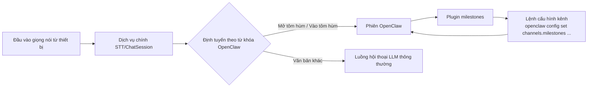

# Hướng dẫn tích hợp OpenClaw

## Sơ đồ kiến trúc

## Các bước cài đặt

1. Đảm bảo OpenClaw đã chạy bình thường.
2. Trong popup `Cài đặt OpenClaw` (OpenClaw设置) của agent, sao chép lệnh cấu hình kênh (channel); hệ thống sẽ tự động điền sẵn WebSocket URL của dịch vụ hiện tại và JWT token của agent đó.
3. Trong phần cấu hình kênh (channel) ở console OpenClaw, thực hiện lần lượt 4 lệnh sau:
   `openclaw config set channels.milestones.enabled true --strict-json`
   `openclaw config set channels.milestones.url "{url}"`
   `openclaw config set channels.milestones.token "{token}"`
   `openclaw gateway restart`
4. Trong đó `{url}` và `{token}` cần thay bằng giá trị thực tế đã sao chép từ popup, cuối cùng chạy `openclaw gateway restart` để cấu hình có hiệu lực.

## Cách sử dụng

1. Trong popup `Cài đặt OpenClaw` của agent, nhấn "Sao chép lệnh".
2. Trong phần cấu hình kênh ở console OpenClaw, chạy 4 lệnh đã sao chép, hoàn tất cấu hình `enabled`, `url`, `token` và khởi động lại gateway.
3. Sau khi cài đặt và cấu hình xong, có thể gọi các năng lực của plugin milestones ngay trong phiên OpenClaw.
4. Trong popup `Xem OpenClaw` (查看openclaw), có thể dùng nút "Gửi thử nghiệm" để kiểm tra kết nối và phản hồi.
5. Ở phía thiết bị, người dùng có thể nói **"Mở tôm hùm" / "Vào tôm hùm"** (nguyên văn tiếng Trung: 打开龙虾 / 进入龙虾) để vào chế độ OpenClaw, và nói **"Tắt tôm hùm" / "Thoát tôm hùm"** (nguyên văn: 关闭龙虾 / 退出龙虾) để thoát khỏi chế độ này.

> _Ghi chú của người dịch: "龙虾" (tôm hùm) ở đây là từ khóa kích hoạt (trigger word) được đặt tên tùy ý cho tính năng OpenClaw trong sản phẩm gốc, không mang ý nghĩa thực về con tôm hùm. Nếu bạn tự triển khai, có thể đổi từ khóa kích hoạt này sang tiếng Việt hoặc từ khác tùy ý trong cấu hình._

## Gợi ý xử lý sự cố

- Trạng thái hiển thị chưa kết nối: hãy xác nhận `channels.milestones.url` và `channels.milestones.token` đang dùng là giá trị mới nhất, và `channels.milestones.enabled` đã được đặt là `true`.
- Kiểm thử hội thoại bị timeout: kiểm tra xem 4 lệnh cấu hình kênh đã chạy thành công chưa, URL/token có chính xác không, đã chạy `openclaw gateway restart` chưa, và phiên OpenClaw có đang online hay không.
