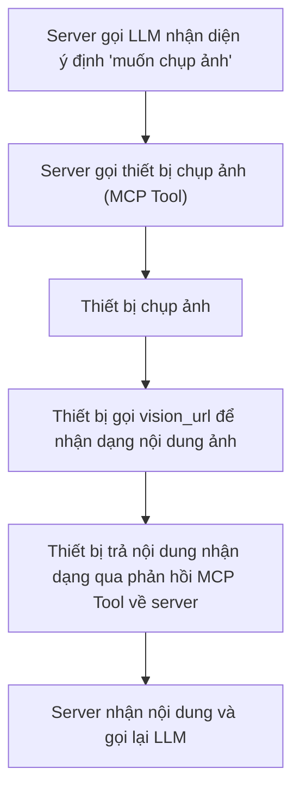

# Quy trình và hướng dẫn cấu hình nhận dạng thị giác (Vision)

## 1. Giới thiệu tính năng

Hệ thống hỗ trợ tính năng nhận dạng thị giác (vision recognition), chủ yếu thông qua việc gọi các dịch vụ nhận dạng thị giác bên ngoài (như Qwen-VL của Alibaba Cloud, Doubao Vision của Volcano Engine, v.v.) để thực hiện khả năng hiểu ảnh, nhận dạng nội dung. Các tham số liên quan có thể được điều chỉnh linh hoạt thông qua file cấu hình.

## 2. Vị trí file cấu hình

File cấu hình liên quan đến nhận dạng thị giác nằm tại:

- `config/config.yaml`: File cấu hình chính, chứa các tham số liên quan đến vision.

## 3. Mô tả các tham số chính

Ví dụ cấu hình mục vision trong `config/config.yaml`:

```yaml
vision:
  enable_auth: false
  vision_url: 'http://192.168.1.97:8989/milestones/api/vision'
  vllm:
    provider: 'aliyun_vision'
    aliyun_vision:
      type: 'openai'
      model_name: 'qwen-vl-plus-latest'
      base_url: 'https://dashscope.aliyuncs.com/compatible-mode/v1'
      api_key: 'api_key'
      max_token: 500
    doubao_vision:
      type: 'openai'
      model_name: 'doubao-1.5-vision-lite-250315'
      api_key: 'api_key'
      base_url: 'https://ark.cn-beijing.volces.com/api/v3'
      max_tokens: 500
```

- `enable_auth`: Có bật xác thực (authentication) cho interface nhận dạng thị giác hay không.
- `vision_url`: **Địa chỉ HTTP request trả về cho client để nhận dạng ảnh**, client sẽ tải ảnh lên qua địa chỉ này và nhận kết quả nhận dạng.
- `vllm.provider`: Chỉ định dịch vụ nhận dạng thị giác đang sử dụng (ví dụ: aliyun_vision, doubao_vision).
- `aliyun_vision`/`doubao_vision`: Tham số kết nối của từng dịch vụ nhận dạng thị giác lớn, bao gồm:
  - `type`: Loại API (ví dụ: interface tương thích OpenAI).
  - `model_name`: Tên model nhận dạng thị giác được sử dụng.
  - `base_url`: Địa chỉ API của dịch vụ.
  - `api_key`: Khóa truy cập dịch vụ.
  - `max_token`/`max_tokens`: Số lượng token tối đa.

## 4. Quy trình cấu hình

1. Dựa theo nhu cầu thực tế, chọn và đăng ký dịch vụ nhận dạng thị giác cần dùng (như Alibaba Cloud, Doubao, v.v.), lấy API Key.
2. Chỉnh sửa `config/config.yaml`, điền vision_url, provider và các tham số của dịch vụ tương ứng vào mục `vision`.
3. Khởi động dịch vụ, kiểm tra log để xác nhận module nhận dạng thị giác đã load thành công.
4. Tải ảnh lên qua API hoặc giao diện frontend để xác nhận hiệu quả nhận dạng.

## 5. Câu hỏi thường gặp và cách xử lý

- **Truy cập interface thất bại**: Kiểm tra `vision_url` có chính xác không, dịch vụ đã khởi động chưa.
- **Xác thực thất bại**: Nếu đã bật xác thực, cần kiểm tra `api_key` có chính xác và còn hiệu lực không.
- **Kết quả nhận dạng bất thường**: Xác nhận provider và tên model đã điền đúng chưa, API Key còn hiệu lực không, dịch vụ bên ngoài có khả dụng không.

---

Nếu cần bổ sung thêm cách gọi API cụ thể, hướng dẫn tích hợp frontend hoặc cấu hình cho từng dịch vụ nhận dạng thị giác riêng, vui lòng liên hệ đội ngũ phát triển.

## 6. Các bước quy trình điển hình và sơ đồ luồng

### Mô tả các bước

1. Server gọi LLM, nhận diện được ý định của người dùng là "muốn chụp ảnh".
2. Server gửi lệnh chụp ảnh xuống thiết bị thông qua MCP Tool.
3. Thiết bị nhận lệnh và tiến hành chụp ảnh.
4. Thiết bị gửi ảnh vừa chụp qua `vision_url` để nhận dạng nội dung ảnh.
5. Thiết bị trả nội dung ảnh đã nhận dạng về server dưới dạng phản hồi (response) của MCP Tool.
6. Sau khi nhận được kết quả chụp ảnh và nhận dạng, server có thể gọi lại LLM để xử lý tiếp.

### Sơ đồ luồng


